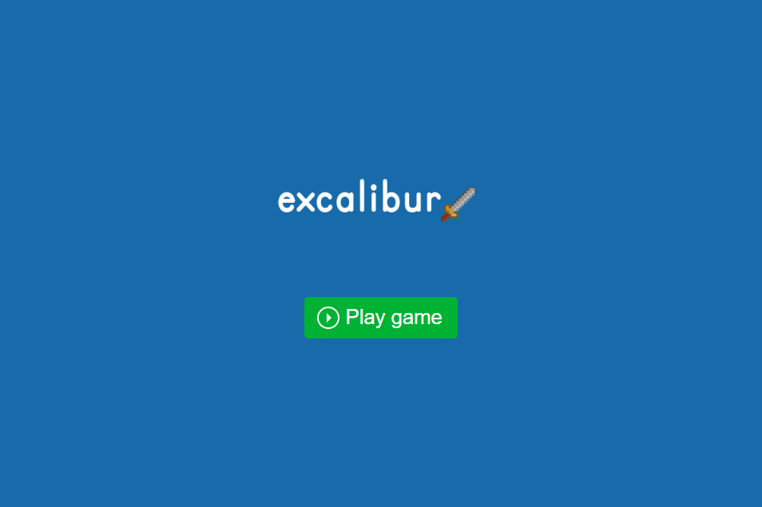
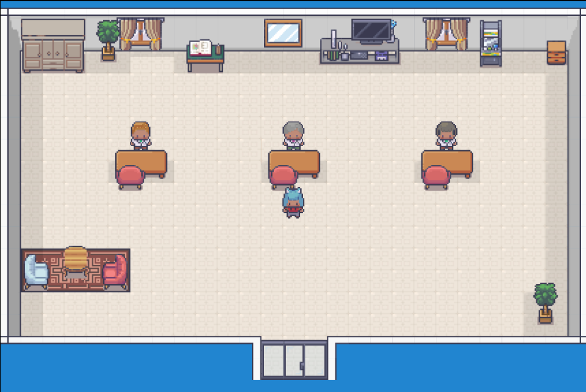

# GamificaAI - Portfólio Interativo em Forma de Jogo

Um portfólio web interativo desenvolvido em formato de jogo 2D para a empresa GamificaAI.  
O projeto foi criado com o objetivo de transformar a experiência de navegação em algo mais dinâmico, divertido e imersivo, utilizando conceitos de gamificação aplicados ao desenvolvimento web.

Esse foi meu primeiro contato com desenvolvimento de jogos, trazendo aprendizados importantes sobre lógica de jogos, movimentação, cenários e integração de ferramentas externas.

</img>

## 🚀 Tecnologias utilizadas

- TypeScript
- Excalibur.js
- Tiled Map Editor
- Character Generator
- HTML5
- CSS3

## 🎮 Sobre o projeto

O projeto consiste em um jogo web 2D utilizado como portfólio interativo para apresentar informações da empresa de maneira criativa.

A experiência foi pensada para tornar a navegação mais envolvente, permitindo que o usuário explore o ambiente enquanto conhece melhor a proposta da GamificaAI.

## ✨ Funcionalidades

- Movimentação do personagem
- Cenários em pixel art
- Mapa desenvolvido no Tiled
- Estrutura de jogo utilizando Excalibur.js
- Navegação interativa
- Experiência gamificada
- Portfólio em formato de jogo web

</img>

## 🗺️ Ferramentas utilizadas

### 🎨 Tiled Map Editor
Utilizado para criação e organização dos mapas e cenários do jogo.

### 🧍 Character Generator
Utilizado para criação e personalização dos personagens.

### ⚙️ Excalibur.js
Biblioteca responsável pela estrutura do jogo, movimentação, colisões e gerenciamento de cenas.

## 📱 Objetivo do projeto

- Criar uma experiência diferenciada para apresentação de portfólio
- Aplicar conceitos de gamificação
- Aprender fundamentos do desenvolvimento de jogos
- Trabalhar com lógica de movimentação e cenários
- Explorar bibliotecas voltadas para jogos web
